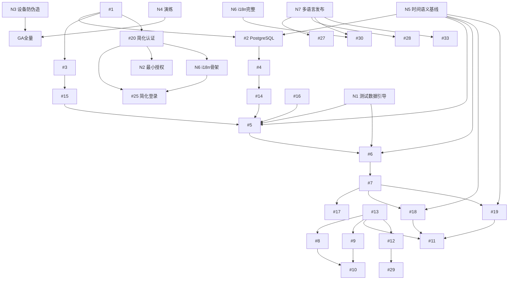

# FOTA 实施计划（Implementation Plan）

- 文档版本：v1.2
- 创建日期：2026-02-04
- 最后更新：2026-02-04
- 维护者：FOTA 架构组 / 平台组
- 适用范围：`wewins-wins-fota-new` 从 0 到 GA 的实施落地

## 变更历史

| 版本 | 日期 | 变更内容 | 变更人 |
|---|---|---|---|
| v1.0 | 2026-02-04 | 首版：重排 Milestone、DAG、Week1、风险与 GA Gate | FOTA 架构组 |
| v1.1 | 2026-02-04 | 增加团队规模模式、PostgreSQL 上手计划、双层 GA Gate、Week1 验收调整 | FOTA 架构组 |
| v1.2 | 2026-02-04 | 新增 N5-N7 任务（时间语义基线、i18n 基础设施、多语言发布说明），支持多时区与国际化 | FOTA 架构组 |

---

## 目录

1. [决策背景](#决策背景)
2. [关键决策记录（内联 ADR）](#关键决策记录内联-adr)
3. [团队规模假设与执行模式](#团队规模假设与执行模式)
4. [PostgreSQL 上手计划](#postgresql-上手计划)
5. [原计划 vs 新计划（对照）](#原计划-vs-新计划对照)
6. [新实施路线（5 个 Milestone）](#新实施路线5-个-milestone)
7. [指标采集与验收方法](#指标采集与验收方法)
8. [任务依赖关系 DAG（修正版）](#任务依赖关系-dag修正版)
9. [Milestone 1 - Week 1 详细计划（基础框架建立周）](#milestone-1---week-1-详细计划基础框架建立周)
10. [高风险任务与缓解措施](#高风险任务与缓解措施)
11. [新增任务说明](#新增任务说明)
12. [双层 GA Gate 条款](#双层-ga-gate-条款)
13. [文档维护策略](#文档维护策略)
14. [附录 A：`docs/week1-acceptance.md` 模板](#附录-a-docsweek1-acceptancemd-模板)
15. [附录 B：`docs/risk-log.md` 模板](#附录-b-docsrisk-logmd-模板)

---

## 决策背景

本计划用于解决 `docs/tasks.md` 的落地问题：

- 数据库选型不一致（架构文档 PostgreSQL，任务文档 MySQL）
- RBAC 前置导致核心数据面 MVP 交付偏晚
- 测试偏后置，性能和可靠性风险暴露过晚
- 测试数据来源不明确，易依赖手工 SQL

---

## 关键决策记录（内联 ADR）

### ADR-001：主业务数据库统一 PostgreSQL
- **状态**：Accepted
- **日期**：2026-02-04
- **决策**：主业务库统一 PostgreSQL
- **原因**：与架构文档一致；JSONB 和分区演进更适配
- **影响**：`docs/tasks.md` 中 MySQL 文案全部替换为 PostgreSQL

### ADR-002：安全能力分阶段建设
- **状态**：Accepted
- **日期**：2026-02-04
- **决策**：M1 最小授权模型（JWT + ADMIN/USER），M4 完整 RBAC
- **原因**：优先打通核心链路，降低早期复杂度

### ADR-003：设备身份认证纳入 GA Gate
- **状态**：Accepted
- **日期**：2026-02-04
- **决策**：MVP 可延后，GA 全量前必须上线
- **原因**：平衡开发速度与公网安全风险

### ADR-004：测试前置与分阶段验收
- **状态**：Accepted
- **日期**：2026-02-04
- **决策**：测试拆分为 M2/M3/M5 三段执行
- **原因**：尽早暴露系统性问题

### ADR-005：时间语义统一（UTC Truth + Policy Timezone）
- **状态**：Accepted
- **日期**：2026-02-04
- **决策**：系统统一使用 UTC 存储，策略时区作为解释维度
- **内容**：
  - 存储层：一律使用 `TIMESTAMPTZ`（UTC）
  - 策略窗口：支持 `UTC_FIXED`（首发）和 `DEVICE_LOCAL`（后续）两种模式
  - 代码规范：禁止 `LocalDateTime.now()`，统一 `Clock` 注入
- **原因**：避免时区混乱导致的时间窗口错误和统计漂移
- **影响**：新增 N5 任务，影响 #2、#5、#6、#18、#19

### ADR-006：i18n 分阶段建设（M1 骨架 + M4 完整）
- **状态**：Accepted
- **日期**：2026-02-04
- **决策**：M1 搭建 i18n 骨架，M4 实现完整双语支持
- **内容**：
  - M1：后端 MessageSource + 前端 i18n 框架接入（zh-CN + en-US）
  - M4：管理后台双语全覆盖，API 错误消息双语化
  - 语言优先级：zh-CN > en-US > 其他（后续）
- **原因**：平衡国际化需求与开发成本
- **影响**：新增 N6 任务（M1+M4），影响 #20、#25、#30

---

## 团队规模假设与执行模式

### 模式 A：3-5 人小团队
- **特征**：角色复用明显，DBA/DevOps/后端可能同人承担
- **执行建议**：降低并行度，Week1 拉长至 7-8 个工作日
- **风险控制**：严格 Must-have 优先，不追求首周"全量完成"

### 模式 B：6+ 人团队
- **特征**：可并行推进（后端、数据、平台、测试分工）
- **执行建议**：按 5 个工作日 Week1 节奏执行
- **风险控制**：每天双清单（Must-have/Nice-to-have）收敛

---

## PostgreSQL 上手计划

- **目标**：降低选型切换带来的首周失败风险
- **预留时间**：1-2 天（可并入 M1 Week1 缓冲）
- **学习范围**：JSONB 基础、索引策略、迁移工具、连接池参数
- **产出物**：
  - `docs/postgresql-playbook.md`
  - `docs/schema-overview.md`
  - `db/migration/` 基础迁移脚本
- **通过标准**：
  - 本地迁移可重复执行
  - 关键查询可解释（Explain）并有索引依据
  - 团队形成最小操作手册

---

## 原计划 vs 新计划（对照）

| 维度 | 原计划 | 新计划 | 调整理由 |
|---|---|---|---|
| 数据库 | MySQL（tasks） | PostgreSQL 统一 | 对齐架构和 JSONB 诉求 |
| 安全时序 | M1 完整 RBAC | M1 最小授权，M4 完整 RBAC | 更快推进核心数据面 |
| 测试策略 | 偏后置 | M2/M3/M5 分段 | 早发现风险 |
| 跨区能力 | M4 才落地 | M3 前移 | 提前验证公网链路 |
| 测试数据 | 未明确 | 新增 N1 引导任务 | 可复现联调 |
| Week1 验收 | 完成率偏高 | 基础框架周，Must-have >= 60% | 更符合从零起步现实 |

---

## 新实施路线（5 个 Milestone）

### Milestone 1：平台基线与最小安全（2 周）

**任务**：#1 #2(改 PostgreSQL) #3 #4 #20(简化) #25(简化) #31(基础) #32(基础) + N1 + N2 + **N5** + **N6(骨架)**

**入口标准**：基础组件可用，核心接口字段冻结 v1

**出口标准（量化）**：
- main/region 连续启动成功 5 次
- 迁移脚本幂等执行 2 轮通过
- 登录 API 50 RPS：p95 < 200ms，错误率 < 0.1%
- USER 对高风险写操作拦截率 100%
- **时间语义规范冻结并评审通过（N5）**
- **i18n 骨架可运行，支持 zh/en 双语（N6）**

---

### Milestone 2：核心数据面 MVP（2-3 周）

**任务**：#14 #15 #16 #5 #6 #7 #17 + #33(子集)

**入口标准**：M1 通过，N1 可用

**出口标准（量化）**：
- check/report 端到端通过率 >= 99.9%（30 分钟）
- check API 200 并发错误率 < 0.5%
- 阶段压测 >= 3000 QPS

---

### Milestone 3：跨区域控制面与汇聚面（2 周）

**任务**：#13 #8 #9 #10 #18 #19 #11 #12 + #33(跨区子集)

**入口标准**：M2 通过，main + 1 region 联通

**出口标准（量化）**：
- 配置变更后 region <= 90s 生效
- 主区恢复后积压 <= 30 分钟清空
- Ingest 重复批次重复写入为 0

---

### Milestone 4：运营能力与完整 RBAC（2 周）

**任务**：#20(完整版) #21 #22 #23 #24 #26 #27 #28 #29 #30 + **N6(完整)** + **N7**

**入口标准**：M3 通过，核心 API 字段冻结

**出口标准（量化）**：
- RBAC 场景测试通过率 100%
- 运营主流程成功率 >= 99%
- 未授权访问拦截率 100%
- **管理后台双语覆盖率 >= 95%（N6）**
- **多语言发布说明流程可用（N7）**

---

### Milestone 5：生产就绪与 GA Gate（1-2 周）

**任务**：#31(生产版) #32(生产版) #33(全量) + N3 + N4

**入口标准**：M4 通过

**出口标准（量化）**：
- check API 99% < 50ms
- 容量 >= 10,000 QPS（目标场景）
- 双层 GA Gate 验收通过并形成报告
- **多语言发布说明抽检通过（N7）**
- **DST 与跨时区回归测试通过**

---

## 指标采集与验收方法

| 指标类型 | 采集方式 | 工具 | 产出物 |
|---|---|---|---|
| 接口性能 | 压测 + 服务端指标 | JMeter/Gatling + Prometheus + Grafana | `reports/perf/*.md` |
| 功能正确性 | 自动化测试 | JUnit5 + MockMvc + Testcontainers | CI 测试报告 |
| 跨区可靠性 | 故障注入与回放 | 演练脚本 + MQ/应用指标 | 演练报告 |
| 安全有效性 | 伪造请求测试 | 安全脚本 + 审计日志 | 安全验收报告 |
| 权限有效性 | RBAC 场景回归 | API 自动化测试 | 权限测试报告 |

---

## 任务依赖关系 DAG（修正版）



---

## Milestone 1 - Week 1 详细计划（基础框架建立周）

**说明**：Week1 目标是"建立基础框架与最小可用链路"，不是交付完整业务功能。
**验收口径**：Week1 Must-have 完成率 >= 60%。

| Day | 目标 | 具体产出物（文件级） | 推荐角色 | Must-have | 降级目标 |
|---|---|---|---|---|---|
| Day 1 | 工程骨架初始化 | `pom.xml`、`Application.java`、`application.yml`、`application-main.yml`、`application-region.yml`、`Dockerfile`(基础) | 后端/平台 | 服务可启动 | 先 main 启动 |
| Day 2 | PostgreSQL 迁移基础 | `db/migration/V1__init_core.sql`、`V2__init_sys.sql`、`docs/schema-overview.md` | 后端/DB 负责人 | 迁移可执行 | 先核心表 |
| Day 3 | Redis 关键结构 | `docs/redis-key-design.md`、`scripts/redis/bootstrap.redis`、`scripts/redis/quota_check.lua`(可选) | 后端/平台 | key 规范冻结 | Lua 后移 |
| Day 4 | 简化认证与最小授权 | `JwtService.java`、`SecurityConfig.java`、`AuthController.java`、`RoleGuard.java`、`docs/min-auth-model.md` | 后端 | 登录+角色限制可用 | 先管理员写保护 |
| Day 5 | 联调与验收 | `scripts/seed/V100__seed_m1.sql`、`docs/week1-acceptance.md`、`docs/risk-log.md`、`monitoring/prometheus-baseline.yml` | 后端/测试/平台 | Must-have >= 60% | 看板后移，先可采集 |

---

## 高风险任务与缓解措施

| 风险 | 影响 | 缓解措施 |
|---|---|---|
| check API 性能不达标 | SLA 风险 | 热路径禁远程依赖，前置压测 |
| 跨公网转发堆积 | 数据延迟 | Forwarder 重试+DLQ+回放 |
| PostgreSQL 学习曲线 | 首周延期 | 预留 1-2 天上手计划 |
| 测试数据不可复现 | 联调效率低 | N1 幂等 seed 脚本 |
| 小团队角色复用 | 并行度不足 | 按 3-5 人模式降并行 |
| **DST/时区口径不一致** | **统计漂移、窗口错误** | **N5 统一时间模型，UTC 存储，查询层转换** |
| **翻译缺失导致误解** | **用户体验下降** | **N6/N7 建立回退链路，翻译覆盖率监控** |

---

## 新增任务说明

### N1：M1 测试数据引导
- **目标**：提供可复现联调数据
- **交付**：产品/固件/策略/设备/管理员 幂等 seed

### N2：最小授权模型
- **目标**：在完整 RBAC 前建立安全边界
- **交付**：ADMIN/USER 两级 + 高风险写操作管理员限制

### N3：设备身份认证与防伪造
- **目标**：拦截伪造设备请求
- **交付**：签名校验 + 时间窗 + nonce 防重放

### N4：灾备与故障演练
- **目标**：验证异常恢复能力
- **交付**：主区不可达/网络分区/MQ 堆积演练报告

### N5：时间语义基线（M1，轻量设计）
- **目标**：建立统一的时间模型标准
- **交付**：
  - `docs/time-semantics.md`（UTC 存储规范、ZoneId 规范、DST 处理原则）
  - 数据模型：策略表 `time_mode`、`policy_timezone`；事件表 `event_time_utc`、`device_timezone`
  - API 约定：预留 `timezone` 参数/请求头
  - 代码规范：统一 `Clock` 注入，禁止 `LocalDateTime.now()`
- **所属里程碑**：Milestone 1（0.5-1 天）

### N6：i18n 基础设施（M1 骨架 + M4 完整）
- **目标**：分阶段实现国际化能力
- **M1 交付（骨架）**：
  - 后端 `MessageSource` + 资源文件（zh-CN、en-US）
  - 错误返回规范：`error_code` + `message_key` + `message`
  - 前端 i18n 框架接入
- **M4 交付（完整）**：
  - 管理后台双语覆盖率 >= 95%
  - API 错误消息双语化
  - 日期时间本地化展示
- **所属里程碑**：Milestone 1（骨架）+ Milestone 4（完整）

### N7：多语言发布说明流程（M4/M5）
- **目标**：让固件 release note 支持多语言治理
- **交付**：
  - 数据模型：`release_note_i18n`（JSONB）
  - 后台能力：支持 zh-CN、en-US 双语录入
  - 回退规则：`en-US` → `zh-CN` 兜底
  - 流程规范：翻译责任、提交流程、检查清单
- **所属里程碑**：Milestone 4（实现）+ Milestone 5（验收）

---

## 双层 GA Gate 条款

### Gate A：GA 小流量灰度（软要求）
- **性能**：核心链路稳定，check API 满足阶段目标
- **安全**：N3 至少完成方案、PoC、测试报告
- **可靠性**：N4 完成首轮演练并可恢复
- **说明**：允许受控灰度，不允许大规模放量

### Gate B：GA 全量（硬要求）
- **性能**：check API 99% < 50ms，容量 >= 10,000 QPS
- **安全**：N3 完整上线并通过验收
- **可靠性**：N4 全场景演练通过，处置手册齐备
- **说明**：未通过 Gate B，不得全量发布

---

## 文档维护策略

- 本文档先行，评审通过后回写 `docs/tasks.md`
- 每次改动必须更新"变更历史"
- 每个 Milestone 结束后更新版本号和验收结果

---

## 附录 A：`docs/week1-acceptance.md` 模板

```markdown
# Week 1 验收报告

- 周期：
- 负责人：
- 执行模式：3-5人 / 6+人

## 1. Must-have 验收

| 项目 | 目标 | 结果(Pass/Fail) | 证据 | 备注 |
|---|---|---|---|---|

## 2. 完成率统计

- Must-have 完成率：
- Nice-to-have 完成率：

## 3. 风险与阻塞

| 风险ID | 描述 | 影响 | 责任人 | 状态 |
|---|---|---|---|---|

## 4. 下周输入

- 必做项：
- 顺延项：
- 依赖项：
```

---

## 附录 B：`docs/risk-log.md` 模板

```markdown
# 风险登记表（Risk Log）

| 风险ID | 日期 | 风险描述 | 触发条件 | 概率(L/M/H) | 影响(L/M/H) | 缓解措施 | 责任人 | 状态(Open/Mitigated/Closed) |
|---|---|---|---|---|---|---|---|---|

## 升级规则

- H/H 风险：当日升级到项目负责人
- 连续两周未下降：触发专项评审
```
