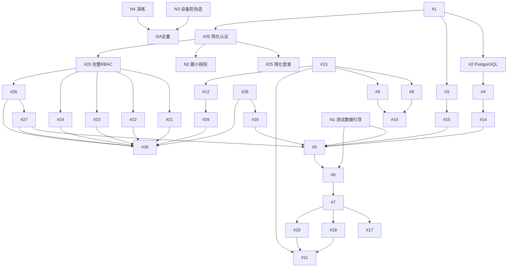

# FOTA 项目开发任务列表

> 本文档基于 PRD 和架构文档生成的完整开发任务列表，共 **33 个主任务 + 7 个新增任务（N1-N7）**，按开发阶段分组。
>
> **⚠️ 重要更新**：本任务列表已根据 `docs/implementation-plan.md v1.1` 进行调整，包括：
> - 数据库选型统一为 PostgreSQL
> - Milestone 重新划分（核心链路优先）
> - 新增 N1-N4 任务（测试数据、最小授权、设备认证、灾备演练）
> - **新增 N5-N7 任务（时间语义基线、i18n 基础设施、多语言发布说明）**
> - 双层 GA Gate（小流量灰度 vs 全量）
>
> 详细变更记录请参考 `docs/implementation-plan.md`

---

## 目录

- [阶段一：基础搭建（4 个任务）](#阶段一基础搭建)
- [阶段二：核心设备 API（3 个任务）](#阶段二核心设备-api)
- [阶段三：跨区域同步机制（6 个任务）](#阶段三跨区域同步机制)
- [阶段四：业务服务层（6 个任务）](#阶段四业务服务层)
- [阶段五：系统管理与鉴权（6 个任务）](#阶段五系统管理与鉴权)
- [阶段六：业务管理后台（5 个任务）](#阶段六业务管理后台)
- [阶段七：部署与监控（3 个任务）](#阶段七部署与监控)
- [实现路径规划](#实现路径规划)

---

## 阶段一：基础搭建

### 任务 #1：项目基础架构搭建

**目标**：搭建 Spring Boot 3.x + Java 21 项目基础架构

**主要内容**：
- 创建 Maven/Gradle 项目结构（推荐 Spring Boot 3.x + Java 21）
- 配置 Docker 多阶段构建支持（MODE=main/region）
- 配置 application.yml 支持多环境配置
- 集成 PostgreSQL、Redis、ClickHouse、RabbitMQ 连接配置
- 配置日志框架（Logback）
- 添加基础依赖（Web、JPA、Redis、MQ、ClickHouse、Validation、Security）
- 创建基础包结构（controller/service/repository/entity/config/mq/utils）
- 配置 MODE 环境变量控制各模块启用的条件装配

**技术要点**：
- Spring Boot 3.x + Java 21
- Spring Security 6.x + JWT
- 条件装配：`@ConditionalOnProperty(name = "mode", havingValue = "main")`
- 多配置文件：`application-main.yml` / `application-region.yml`

---

### 任务 #2：数据库设计与迁移脚本

**目标**：设计并创建数据库表结构

**PostgreSQL 主表**：

| 表名 | 关键字段 | 索引 |
|------|---------|------|
| sys_users | id, username, password, email, status | username 唯一 |
| sys_roles | id, role_code, role_name, description | role_code 唯一 |
| sys_permissions | id, perm_code, perm_name, resource_type, resource_path | perm_code 唯一 |
| sys_user_roles | user_id, role_id | user_id + role_id |
| sys_role_permissions | role_id, perm_id | role_id + perm_id |
| sys_dict | id, dict_code, dict_name, description | dict_code 唯一 |
| sys_dict_items | id, dict_id, item_label, item_value, sort_order | dict_id |
| products | id, name, secret_key | - |
| devices | id, imei(唯一), product_id, tags(JSON), home_region, last_seen | imei 唯一索引 |
| policies | id, product_id, gray_rate, max_limit, version_range(JSON), tag_filter(JSON) | product_id |
| firmware | id, product_id, version, file_hash, is_patch | product_id + version |
| config_versions | product_id, policy_ver, product_ver, control_ver | product_id |

**ClickHouse 表**：

| 表名 | 用途 |
|------|------|
| upgrade_events | 事件明细（DL_START/DL_OK/DL_FAIL/UP_OK） |
| upgrade_events_1m | 分钟聚合统计 |
| device_region_index_5m | 设备定位索引（5分钟桶） |

**工具**：使用 Flyway 或 Liquibase 进行版本管理

---

### 任务 #3：Redis 数据结构设计脚本

**目标**：设计 Redis 数据结构并创建初始化脚本

**核心数据结构**：
```
# 设备状态缓存
dev:stat:{product}:{imei} = {enabled, tag_hash, device_id, home_region}

# 策略快照
pol:snap:{product}:v{ver}          # 策略快照内容
pol:active_ver:{product}            # 当前版本指针

# 配额控制
pol:quota:{product}:{policy_id}:{date} = count

# 控制参数
ctrl:product:{product}:next_interval

# 活跃度位图
dev:active:{product}:{date}         # Bitmap, offset=device_id

# 限流
ratelimit:{product}:{imei}:{window} = count

# HMAC 防重放
ingest:seen:{batch_id}              # TTL 7天
auth:nonce:{region}:{nonce}         # TTL 10分钟

# 用户权限缓存
user:perms:{user_id}                # 用户权限列表 TTL 30min
user:roles:{user_id}                # 用户角色列表 TTL 30min

# 字典缓存
dict:all:{dict_code}                # 字典项列表 TTL 1h
```

**Lua 脚本**：
- 原子配额检查与扣减
- 灰度桶判断

---

### 任务 #4：核心实体类与 Repository 层

**目标**：创建 JPA 实体类和 Repository

**Entity 类**：
- `SysUser.java`（系统用户实体）
- `SysRole.java`（系统角色实体）
- `SysPermission.java`（系统权限实体）
- `SysDict.java`（字典实体）
- `SysDictItem.java`（字典项实体）
- `Product.java`（产品实体）
- `Device.java`（设备实体，JSON tags 映射）
- `Policy.java`（策略实体）
- `Firmware.java`（固件实体）
- `ConfigVersion.java`（配置版本实体）

**Repository 接口**：
- `SysUserRepository`、`SysRoleRepository`、`SysPermissionRepository`
- `SysDictRepository`、`SysDictItemRepository`
- `DeviceRepository`（含按 imei 查询、批量查询）
- `PolicyRepository`（含按产品ID查询生效策略）
- `ProductRepository`、`FirmwareRepository`

**DTO 类**：
- `CheckRequest`、`CheckResponse`
- `ReportRequest`
- `PolicySnapshot`、`ProductSnapshot`
- `LoginRequest`、`LoginResponse`

---

## 阶段二：核心设备 API

### 任务 #5：设备检查更新 API (GET/POST /v1/upgrade/check)

**目标**：实现核心的检查更新接口（性能要求：99% < 50ms）

**主流程**：
1. 参数验证（product, imei, version）
2. 从 Redis 获取设备状态缓存，miss 则从主区批量加载
3. SETBIT 标记今日活跃设备（`dev:active:{product}:{date}`）
4. 执行限流检查（ratelimit 防止单设备频繁请求）
5. 从策略快照匹配策略：
   - 版本号匹配
   - 标签匹配（JSON）
   - 灰度判断：`hash(imei) % 100 < gray_rate`
6. 检查时间窗口（start_time/end_time）
7. 原子检查并扣减配额（Lua 脚本）
8. 检查策略 stop 开关
9. 生成带签名的下载 URL（内嵌 policy_id）
10. 返回响应（含 next_check_interval、downloadDelay）

**性能要求**：
- 99% 请求 < 50ms
- P99 < 100ms

---

### 任务 #6：设备上报 API (POST /v1/upgrade/report)

**目标**：实现设备状态上报接口（发后即忘模式）

**支持事件类型**：
- `DL_START`（开始下载）
- `DL_OK`（下载完成）
- `DL_FAIL`（下载失败）
- `UP_OK`（升级成功）

**处理流程**：
1. 参数验证（imei, url, event, details）
2. 从 URL 提取 policy_id
3. 构造事件消息（含 product_id, imei, event, timestamp, region）
4. 发送到本地 RabbitMQ（`q.upgrade_events`）
5. 立即返回 200 OK（不等待数据库写入）

**消息结构**：
```json
{
  "imei": 861234567890123,
  "product_id": "xxx",
  "policy_id": 101,
  "event": "DL_OK",
  "details": {},
  "timestamp": 1234567890,
  "region": "jp"
}
```

---

### 任务 #7：RabbitMQ 消费者与事件处理

**目标**：创建 MQ 消费者处理事件上报

**Consumer 配置**：
- 监听队列：`q.upgrade_events`
- 并发消费者：可配置
- 手动 ACK 确保不丢数据

**处理逻辑**：
1. 批量写入 ClickHouse `upgrade_events` 表
2. 同步更新设备表的 `last_seen` 时间（异步）
3. UP_OK 事件时：更新设备的 `current_version`
4. 维护内存聚合器，生成：
   - `upgrade_events_1m`（1分钟聚合数据）
   - `device_index_5m`（5分钟设备定位索引）

**错误处理**：
- 重试机制：最多 3 次
- 失败后进入 DLQ
- 死信队列处理与告警

---

## 阶段三：跨区域同步机制

### 任务 #8：配置版本轮询 API (GET /internal/config/version)

**目标**：实现主区域配置版本查询接口（仅 MODE=main）

**接口定义**：
```http
GET /internal/config/version?product_id=xxx
```

**返回格式**：
```json
{
  "policy_ver": 42,
  "product_ver": 18,
  "control_ver": 7
}
```

**功能**：
- 从 config_versions 表查询当前版本号
- 无版本时返回初始版本（0 或 1）
- 使用 Redis 缓存版本号

---

### 任务 #9：配置快照 API (GET /internal/config/snapshot/*)

**目标**：实现主区域配置快照拉取接口（仅 MODE=main）

**三个快照接口**：
```http
GET /internal/config/snapshot/policy?product_id=xxx&ver=42
GET /internal/config/snapshot/product?product_id=xxx&ver=18
GET /internal/config/snapshot/control?product_id=xxx&ver=7
```

**快照内容要求**：
- Policy Snapshot：所有生效策略 + 灰度规则 + 配额参数
- Product Snapshot：产品基础配置 + 固件元数据
- Control Snapshot：控制参数（默认 next_interval）

**返回格式**：紧凑 JSON，可直接存入 Redis

---

### 任务 #10：配置同步 Worker (MODE=region)

**目标**：实现区域配置同步后台任务（仅 MODE=region）

**同步流程**：
1. 每 30 秒轮询主区 `/internal/config/version`
2. 对比本地 Redis 中的版本指针
3. 版本变化时拉取对应快照
4. 写入快照到 `pol:snap:{product}:v{ver}`
5. 原子切换 `pol:active_ver:{product}`
6. 保留最近 3 个版本快照

**降级策略**：
- 主区不可达时继续使用已知快照
- 超过 24h 未同步：禁止新策略生效、拉长 next_check_interval

---

### 任务 #11：Forwarder 跨区域数据转发 (MODE=region)

**目标**：实现 Forwarder 转发聚合数据到主区（仅 MODE=region）

**转发队列**：
- `q.forward.device_index_5m`
- `q.forward.upgrade_events_1m`

**触发策略**：
- batch_size ≥ 1000 或
- 等待时间 ≥ 15 秒

**转发流程**：
1. 批量从队列拉取消息
2. 生成 batch_id（UUID）
3. HMAC 签名请求体
4. POST 到主区 `/internal/ingest/*`
5. 成功则 ACK，失败则重试（最多 3 次）

---

### 任务 #12：跨区域数据接入 API (POST /internal/ingest/*)

**目标**：实现主区域接收跨区域数据的接口（仅 MODE=main）

**两个接入接口**：
```http
POST /internal/ingest/device_index_5m
POST /internal/ingest/upgrade_events_1m
```

**请求体**：
```json
{
  "batch_id": "uuid",
  "region": "jp",
  "data": [...]
}
```

**处理流程**：
1. HMAC 鉴权验证
2. 时间戳校验（±5 分钟）
3. nonce 去重（Redis 10分钟 TTL）
4. batch_id 幂等性检查（Redis 7天 TTL）
5. 批量写入 ClickHouse 对应表

---

### 任务 #13：HMAC 跨区域鉴权工具类

**目标**：实现跨区域 HTTPS 通信的安全鉴权机制

**签名算法（HmacSHA256）**：
```
signature = HMAC-SHA256(secret_key, timestamp + nonce + body_sha256)
```

**工具类方法**：
- `generateSignature(region, timestamp, nonce, body)`：生成签名
- `verifySignature(request)`：验证签名
- `generateNonce()`：生成 nonce
- `calculateBodyHash(body)`：Body SHA256 计算

**请求头**：
- `X-Region`: 区域标识
- `X-Timestamp`: Unix 时间戳
- `X-Nonce`: 随机字符串
- `X-Body-SHA256`: 请求体哈希
- `X-Signature`: 最终签名

---

## 阶段四：业务服务层

### 任务 #14：设备管理服务层

**目标**：实现设备管理业务逻辑

**DeviceService 方法**：
1. `getDeviceByImei(product_id, imei)`：优先从 Redis 缓存读取
2. `createDevice(...)`：生成自增 ID（用于 Bitmap offset）
3. `updateDeviceVersion(device_id, new_version)`：异步更新
4. `batchGetDevices(product_id, imei_list)`：批量查询优化
5. `updateLastSeen(device_id)`：异步更新（限流 1 小时一次）

---

### 任务 #15：策略匹配引擎

**目标**：实现策略匹配的核心逻辑

**匹配条件**：
1. product_id 匹配
2. version 在策略的 version_range 范围内
3. tags 满足 tag_filter 条件（JSON）
4. 灰度判断：`hash(imei) % 100 < gray_rate`
5. 时间窗口检查
6. 配额检查
7. 策略开关检查

**Lua 脚本**：
- 原子配额检查与递增
- 返回是否允许升级

**缓存策略**：
- 使用 Caffeine 本地缓存策略快照

---

### 任务 #16：固件下载 URL 签名生成

**目标**：实现预签名 URL 生成（模拟 S3 Pre-signed URL）

**URL 格式**：
```
https://cdn.xxx.com/pkg.bin?p_id=101&expires=1234567890&sig=abc123...
```

**生成逻辑**：
1. 获取固件元数据（file_path, size, hash）
2. 生成签名参数（policy_id, expires, signature）
3. 构造 URL

---

### 任务 #17：Redis Bitmap 活跃度统计

**目标**：实现基于 Redis Bitmap 的设备活跃度统计

**标记活跃设备**：
```java
SETBIT dev:active:{product}:{date} {device_id} 1
```

**统计功能**：
1. `getActiveCount(product, date)`：返回当日活跃设备数
2. `getInactiveDevices(product, days)`：计算离线 N 天的设备
3. `getDAU(product, startDate, endDate)`：返回趋势数据

**存储优势**：
- 1 亿设备 ≈ 12MB/天
- BITCOUNT 耗时 < 3ms

---

### 任务 #18：设备定位索引聚合器

**目标**：实现设备 5 分钟定位索引聚合

**聚合逻辑**：
1. 从 upgrade_events 事件流提取数据
2. 按 5 分钟时间桶聚合
3. 统计 event_cnt、last_event_time
4. 输出到内存聚合器 + 本地 ClickHouse

**定时发送**：每 5 分钟或累积 1000 条触发

---

### 任务 #19：事件分钟级聚合器

**目标**：实现升级事件的 1 分钟聚合统计

**聚合维度**：
- product_id, policy_id, event_type, minute

**聚合指标**：
- event_cnt、success_cnt、fail_cnt
- unique_devices（HyperLogLog）

**定时任务**：每分钟触发一次

---

## 阶段五：系统管理与鉴权

### 任务 #20：Spring Security + JWT 认证配置

**目标**：实现基于 JWT 的用户认证和授权框架

**主要功能**：
1. **JWT 工具类**：
   - 生成 JWT Token（Access Token + Refresh Token）
   - Token 验证与解析
   - Token 刷新机制

2. **Spring Security 配置**：
   - Security Filter Chain 配置
   - 密码加密（BCrypt）
   - CORS 配置
   - 无状态会话管理

3. **认证过滤器**：
   - JWT Authentication Filter
   - 从请求头提取和验证 Token
   - 设置 Security Context

4. **权限注解支持**：
   - `@PreAuthorize` 支持
   - 自定义权限评估器

**技术选型**：
- Spring Security 6.x
- JJWT（JWT 生成与验证）
- Redis 存储 Token 黑名单

**Token 设计**：
```json
{
  "sub": "user_id",
  "username": "admin",
  "roles": ["ROLE_ADMIN"],
  "perms": ["user:create", "user:update"],
  "iat": 1234567890,
  "exp": 1234570490
}
```

---

### 任务 #21：用户管理（RBAC）

**目标**：实现用户管理的完整功能

**数据库表**：
```sql
-- sys_users
- id: BIGINT 主键
- username: VARCHAR(50) 唯一
- password: VARCHAR(255) 加密
- email: VARCHAR(100)
- phone: VARCHAR(20)
- real_name: VARCHAR(50)
- status: TINYINT (0:禁用 1:启用)
- avatar: VARCHAR(255)
- dept_id: BIGINT (部门ID，可选)
- created_at, updated_at

-- sys_user_roles (关联表)
- user_id: BIGINT
- role_id: BIGINT
```

**API 接口**（需 `user:manage` 权限）：
- `POST /api/v1/system/users` - 创建用户
- `GET /api/v1/system/users` - 用户列表（分页、筛选）
- `GET /api/v1/system/users/{id}` - 用户详情
- `PUT /api/v1/system/users/{id}` - 更新用户
- `DELETE /api/v1/system/users/{id}` - 删除用户
- `POST /api/v1/system/users/{id}/roles` - 分配角色
- `POST /api/v1/system/users/{id}/reset-password` - 重置密码
- `POST /api/v1/system/users/{id}/change-status` - 启用/禁用

**业务逻辑**：
- 密码强度校验
- 用户名唯一性校验
- 密码加密存储
- 用户状态管理
- 角色分配（多对多）

---

### 任务 #22：角色管理（RBAC）

**目标**：实现角色管理的完整功能

**数据库表**：
```sql
-- sys_roles
- id: BIGINT 主键
- role_code: VARCHAR(50) 唯一（如 ROLE_ADMIN）
- role_name: VARCHAR(50)
- description: VARCHAR(200)
- sort_order: INT
- status: TINYINT
- created_at, updated_at

-- sys_role_permissions (关联表)
- role_id: BIGINT
- perm_id: BIGINT
```

**API 接口**（需 `role:manage` 权限）：
- `POST /api/v1/system/roles` - 创建角色
- `GET /api/v1/system/roles` - 角色列表
- `GET /api/v1/system/roles/{id}` - 角色详情
- `PUT /api/v1/system/roles/{id}` - 更新角色
- `DELETE /api/v1/system/roles/{id}` - 删除角色
- `POST /api/v1/system/roles/{id}/permissions` - 分配权限
- `GET /api/v1/system/roles/{id}/permissions` - 查询角色权限
- `GET /api/v1/system/roles/{id}/users` - 查询角色下的用户

**业务逻辑**：
- 角色代码唯一性
- 权限分配（多对多）
- 角色层级（可选，如角色继承）
- 预置角色：超级管理员、管理员、操作员、访客

---

### 任务 #23：权限管理（RBAC）

**目标**：实现权限管理的完整功能

**数据库表**：
```sql
-- sys_permissions
- id: BIGINT 主键
- perm_code: VARCHAR(100) 唯一（如 user:create）
- perm_name: VARCHAR(50)
- resource_type: VARCHAR(20) (menu/button/api)
- resource_path: VARCHAR(200) (如 /api/v1/system/users)
- http_method: VARCHAR(10) (GET/POST/PUT/DELETE)
- parent_id: BIGINT (树形结构)
- sort_order: INT
- icon: VARCHAR(50)
- status: TINYINT
- created_at, updated_at
```

**API 接口**（需 `perm:manage` 权限）：
- `POST /api/v1/system/permissions` - 创建权限
- `GET /api/v1/system/permissions` - 权限列表（树形结构）
- `GET /api/v1/system/permissions/{id}` - 权限详情
- `PUT /api/v1/system/permissions/{id}` - 更新权限
- `DELETE /api/v1/system/permissions/{id}` - 删除权限
- `GET /api/v1/system/permissions/tree` - 权限树

**权限设计**：
```
系统管理 (system)
├── 用户管理 (user:manage)
│   ├── user:view    (查看)
│   ├── user:create  (创建)
│   ├── user:update  (更新)
│   └── user:delete  (删除)
├── 角色管理 (role:manage)
│   ├── role:view
│   ├── role:create
│   ├── role:update
│   └── role:delete
└── 权限管理 (perm:manage)
    ├── perm:view
    ├── perm:create
    ├── perm:update
    └── perm:delete

业务管理 (business)
├── 产品管理 (product:manage)
├── 策略管理 (policy:manage)
├── 固件管理 (firmware:manage)
└── 设备管理 (device:view)
```

**RBAC 实现**：
1. 用户 → 角色（多对多）
2. 角色 → 权限（多对多）
3. 用户拥有所有角色的权限并集
4. 权限缓存到 Redis：`user:perms:{user_id}`

---

### 任务 #24：字典管理

**目标**：实现系统字典的管理功能

**数据库表**：
```sql
-- sys_dict (字典类型)
- id: BIGINT 主键
- dict_code: VARCHAR(50) 唯一（如 DEVICE_STATUS）
- dict_name: VARCHAR(50) (如 设备状态)
- description: VARCHAR(200)
- sort_order: INT
- status: TINYINT
- created_at, updated_at

-- sys_dict_items (字典项)
- id: BIGINT 主键
- dict_id: BIGINT 外键
- item_label: VARCHAR(100) (如 在线)
- item_value: VARCHAR(100) (如 online)
- tag_class: VARCHAR(50) (如 success - 用于前端颜色)
- sort_order: INT
- status: TINYINT
- created_at, updated_at
```

**API 接口**（需 `dict:manage` 权限）：
- `POST /api/v1/system/dict` - 创建字典类型
- `GET /api/v1/system/dict` - 字典类型列表
- `GET /api/v1/system/dict/{code}` - 获取字典项列表（根据 code）
- `PUT /api/v1/system/dict/{id}` - 更新字典类型
- `DELETE /api/v1/system/dict/{id}` - 删除字典类型

- `POST /api/v1/system/dict-items` - 创建字典项
- `GET /api/v1/system/dict-items` - 字典项列表
- `PUT /api/v1/system/dict-items/{id}` - 更新字典项
- `DELETE /api/v1/system/dict-items/{id}` - 删除字典项

**常用字典示例**：
```
DEVICE_STATUS: 设备状态
  - online: 在线
  - offline: 离线
  - upgrading: 升级中

UPGRADE_EVENT: 升级事件
  - DL_START: 开始下载
  - DL_OK: 下载完成
  - DL_FAIL: 下载失败
  - UP_OK: 升级成功

POLICY_STATUS: 策略状态
  - pending: 待执行
  - running: 执行中
  - paused: 已暂停
  - completed: 已完成
```

**缓存策略**：
- 字典数据缓存到 Redis：`dict:all:{dict_code}`
- TTL: 1 小时
- 字典更新时清除缓存

---

### 任务 #25：登录与鉴权 API

**目标**：实现用户登录、登出、Token 刷新等接口

**API 接口**：
- `POST /api/v1/auth/login` - 用户登录
- `POST /api/v1/auth/logout` - 用户登出
- `POST /api/v1/auth/refresh` - 刷新 Token
- `GET /api/v1/auth/info` - 获取当前用户信息
- `POST /api/v1/auth/change-password` - 修改密码

**登录请求**：
```json
{
  "username": "admin",
  "password": "123456",
  "captcha": "abcd",
  "captcha_key": "uuid"
}
```

**登录响应**：
```json
{
  "access_token": "eyJhbGciOiJIUzI1NiIs...",
  "refresh_token": "eyJhbGciOiJIUzI1NiIs...",
  "expires_in": 7200,
  "user": {
    "id": 1,
    "username": "admin",
    "real_name": "管理员",
    "email": "admin@example.com",
    "avatar": "https://...",
    "roles": ["ROLE_ADMIN"],
    "permissions": ["user:create", "user:update", ...]
  }
}
```

**业务逻辑**：
1. 验证码校验（Redis 存储）
2. 用户名密码验证
3. 加载用户角色和权限
4. 生成 JWT Token
5. Token 存入 Redis（可选，用于强制登出）
6. 返回 Token 和用户信息

**安全措施**：
- 密码错误 5 次锁定账户 30 分钟
- Token 过期时间：2 小时
- Refresh Token 过期时间：7 天
- 登出时将 Token 加入黑名单（Redis）

---

## 阶段六：业务管理后台

### 任务 #26：产品管理后台 API

**接口列表**（需 `product:manage` 权限）：
- `POST /api/v1/admin/products` - 创建产品
- `GET /api/v1/admin/products` - 查询产品列表
- `GET /api/v1/admin/products/{id}` - 获取产品详情
- `PUT /api/v1/admin/products/{id}` - 更新产品
- `DELETE /api/v1/admin/products/{id}` - 删除产品
- `POST /api/v1/admin/products/{id}/regenerate-key` - 重置密钥

---

### 任务 #27：策略管理后台 API

**接口列表**（需 `policy:manage` 权限）：
- `POST /api/v1/admin/policies` - 创建策略
- `GET /api/v1/admin/policies` - 查询策略列表
- `GET /api/v1/admin/policies/{id}` - 获取策略详情
- `PUT /api/v1/admin/policies/{id}` - 更新策略
- `DELETE /api/v1/admin/policies/{id}` - 删除策略
- `POST /api/v1/admin/policies/{id}/stop` - 紧急停止策略
- `POST /api/v1/admin/policies/{id}/resume` - 恢复策略
- `GET /api/v1/admin/policies/{id}/stats` - 策略执行统计

---

### 任务 #28：固件上传与管理 API

**接口列表**（需 `firmware:manage` 权限）：
- `POST /api/v1/admin/firmware/upload` - 上传固件
- `GET /api/v1/admin/firmware` - 查询固件列表
- `GET /api/v1/admin/firmware/{id}` - 获取固件详情
- `DELETE /api/v1/admin/firmware/{id}` - 删除固件

---

### 任务 #29：设备查询与统计 API

**查询接口**（需 `device:view` 权限）：
- `GET /api/v1/admin/devices` - 查询设备列表
- `GET /api/v1/admin/devices/{imei}` - 获取设备详情
- `GET /api/v1/admin/devices/{imei}/events` - 查询设备事件日志

**统计接口**（需 `device:stats` 权限）：
- `GET /api/v1/admin/stats/overview` - 总览统计
- `GET /api/v1/admin/stats/active-trend` - 活跃度趋势
- `GET /api/v1/admin/stats/upgrade-progress` - 升级进度
- `GET /api/v1/admin/stats/offline-devices` - 离线设备分析

---

### 任务 #30：管理后台前端开发

**技术选型**：
- Vue 3 + TypeScript + Vite
- Element Plus 或 Ant Design Vue
- Axios + 请求拦截器
- ECharts（图表展示）
- Pinia（状态管理）
- Vue Router（路由）

**页面模块**：

**1. 系统管理模块**：
- 登录页（`/login`）
  - 用户名密码登录
  - 验证码
  - 记住密码

- 用户管理（`/system/users`）
  - 用户列表（分页、搜索）
  - 新增/编辑用户
  - 分配角色
  - 重置密码
  - 启用/禁用

- 角色管理（`/system/roles`）
  - 角色列表
  - 新增/编辑角色
  - 分配权限（树形选择）
  - 查看角色用户

- 权限管理（`/system/permissions`）
  - 权限树展示
  - 新增/编辑权限
  - 权限类型标识（菜单/按钮/API）

- 字典管理（`/system/dict`）
  - 字典类型列表
  - 字典项管理
  - 启用/禁用

**2. 业务管理模块**：
- 产品管理（`/admin/products`）
- 策略管理（`/admin/policies`）
- 固件管理（`/admin/firmware`）
- 设备中心（`/admin/devices`）

**3. 数据看板模块**：
- 总览页（`/dashboard`）
  - 关键指标卡片
  - 升级进度图表
  - 活跃度趋势
  - 实时监控

**功能特性**：
- 表格分页、排序、筛选
- 表单验证
- 权限控制（路由守卫 + 按钮级权限）
- 实时数据刷新
- 图表可视化
- 国际化支持（可选）

**路由权限控制**：
```typescript
const routes = [
  {
    path: '/system/users',
    name: 'UserManage',
    meta: { permission: 'user:view', title: '用户管理' }
  }
]
```

---

## 阶段七：部署与监控

### 任务 #31：Docker 多阶段构建配置

**Dockerfile 设计**：
```dockerfile
# Stage 1: Build
FROM maven:3.9-eclipse-temurin-21 AS build
COPY pom.xml /app/
COPY src /app/src
RUN mvn package -DskipTests

# Stage 2: Runtime
FROM eclipse-temurin:21-jre-alpine
COPY --from=build /app/target/*.jar app.jar
ENTRYPOINT ["java", "-jar", "app.jar"]
```

---

### 任务 #32：监控与可观测性集成

**Prometheus 指标**：
- HTTP 请求：QPS、P99 延迟、错误率
- JVM：GC、堆内存、线程数
- Redis、RabbitMQ、ClickHouse 指标

**自定义业务指标**：
- upgrade_check_total
- upgrade_success_total
- active_devices_gauge

---

### 任务 #33：单元测试与集成测试

**单元测试**（JUnit 5）：
- Service 层业务逻辑测试
- PolicyMatcher 匹配逻辑
- HMAC 签名验证

**集成测试**：
- API 接口测试（MockMvc）
- 数据库操作测试（Testcontainers）
- MQ 消费者测试

**性能测试**：
- Check API 压测
- 目标：10000 QPS, P99 < 50ms

---

## 新增任务（N1-N4）

> 根据 `docs/implementation-plan.md v1.1` 补充的关键任务

### 任务 N1：M1 测试数据引导

**目标**：为 Milestone 2 提供可复现的联调数据

**主要内容**：
- 创建幂等的 seed 脚本（`scripts/seed/V100__seed_m1.sql`）
- 包含数据：
  - 1 个产品样例
  - 1 个固件样例
  - 1 条策略样例
  - 若干设备样本
  - 1 个管理员账号
- 脚本要求：
  - 可重复执行（幂等性）
  - 不污染历史数据
  - 支持快速环境初始化

**验收标准**：
- 空库可一键导入
- 重复执行不报错
- 数据完整性验证通过

**所属里程碑**：Milestone 1

---

### 任务 N2：最小授权模型

**目标**：在完整 RBAC 之前建立最小安全边界

**主要内容**：
- 实现两级角色：`ADMIN`、`USER`
- 高风险写操作仅 `ADMIN` 可执行：
  - 删除产品/策略/固件
  - 停止/恢复策略
  - 修改关键配置
- 实现 `RoleGuard` 拦截器

**技术要点**：
- 基于注解的权限控制（`@RequireRole("ADMIN")`）
- 最小权限原则
- 防止权限升级

**验收标准**：
- USER 角色无法执行高风险操作
- ADMIN 角色可执行全量操作（临时阶段）
- 拦截率 100%

**所属里程碑**：Milestone 1
**依赖任务**：#20（简化版认证）

---

### 任务 N3：设备身份认证与防伪造

**目标**：拦截伪造设备请求，防止恶意刷量

**主要内容**：
- 实现请求签名机制（HMAC-SHA256）
- 时间窗校验（±5 分钟）
- Nonce 防重放（Redis TTL 10 分钟）
- 异常设备行为风控

**技术要点**：
- 设备端使用 `ProductSecret` 签名请求
- 服务端验证签名完整性
- 性能影响可控（< 5ms）

**验收标准**：
- 伪造请求拦截率 100%
- 性能影响 < 5ms
- 不影响正常设备升级

**所属里程碑**：Milestone 5（GA Gate 强制项）

---

### 任务 N4：灾备与故障演练

**目标**：验证系统在异常场景下的恢复能力

**演练场景**：
1. **主区不可达**：Region 在主区宕机 30 分钟后的行为
2. **网络分区**：跨区网络抖动与恢复
3. **MQ 堆积**：Forwarder 堆积与恢复流程
4. **Ingest 幂等**：重复批次不产生重复写入

**产出物**：
- 演练报告（含恢复时长、数据一致性验证）
- 故障处置手册
- 告警有效性验证

**验收标准**：
- 所有演练场景通过
- 恢复时长满足目标
- 有完整的处置 SOP

**所属里程碑**：Milestone 5（GA Gate 强制项）

---

### 任务 N5：时间语义基线

**目标**：建立统一的时间模型标准，避免后续返工

**主要内容**：
- 定义 UTC 存储规范（PostgreSQL `TIMESTAMPTZ`）
- 定义时区字段规范（IANA ZoneId）
- 定义 DST 处理原则
- 预留策略时间窗口模式（`UTC_FIXED` / `DEVICE_LOCAL`）

**关键交付**：
- `docs/time-semantics.md`（时间语义规范文档）
- 数据模型增量设计：
  - 策略表：`time_mode`、`policy_timezone` 字段
  - 事件表：`event_time_utc`、`device_timezone` 字段
- API 约定：预留 `timezone` 参数/请求头
- 代码规范：统一 `Clock` 注入，禁止直接 `LocalDateTime.now()`

**技术要点**：
- Java `java.time` 全面替代旧时间 API
- PostgreSQL `TIMESTAMPTZ` 存储
- DST 边界处理（春令时跳时/秋令时回拨）
- 时区转换性能优化

**验收标准**：
- 时间语义规范评审通过并冻结
- 至少 3 个 DST 边界样例文档化
- 关键表字段和索引策略在任务 #2 中落地

**所属里程碑**：Milestone 1（轻量设计任务，0.5-1 天）
**依赖任务**：被 #2、#5、#6、#18、#19 依赖

---

### 任务 N6：i18n 基础设施（M1 骨架 + M4 完整）

**目标**：分阶段实现国际化能力

**M1 交付（骨架）**：
- 后端 `MessageSource` 与资源文件：
  - `messages_zh_CN.properties`
  - `messages_en_US.properties`
- 错误返回规范：`error_code` + `message_key` + `message`
- 前端 i18n 框架接入（Vue i18n / React i18n）
- 语言协商策略：`Accept-Language` + 用户配置兜底

**M4 交付（完整）**：
- 管理后台双语全覆盖：
  - 菜单、按钮、表单、校验、提示
  - 日期时间本地化展示
- API 错误消息双语化（核心接口）
- 用户语言偏好持久化

**技术要点**：
- Spring MessageSource + ResourceBundle
- 前端 i18n 库 + IANA Time Zone 数据
- 翻译回退链路（`zh-CN` → `en-US`）
- 翻译覆盖率监控

**验收标准**：
- M1：登录与 2 个核心接口能按语言返回文案
- M4：后台核心页面双语覆盖率 >= 95%

**所属里程碑**：Milestone 1（骨架）+ Milestone 4（完整）

---

### 任务 N7：多语言发布说明流程

**目标**：让固件 release note 支持多语言治理与发布

**主要内容**：
- 数据模型：发布说明支持多语言结构
  - `release_note_i18n`（JSONB）
- 后台能力：策略/固件发布时录入多语言说明
  - 至少支持 `zh-CN`、`en-US`
- 回退规则：缺失语言时按 `en-US` → `zh-CN` 兜底
- 流程规范：翻译责任、提交流程、检查清单

**技术要点**：
- JSONB 存储多语言映射
- 多语言表单验证与提交
- API 返回时按设备 `lang` 返回对应语言

**验收标准**：
- 同一固件可按语言返回不同说明文本
- 缺失语言兜底逻辑稳定可测
- M5 验收报告包含多语言发布说明抽检

**所属里程碑**：Milestone 4（实现）+ Milestone 5（验收）
**依赖任务**：#27、#28、#30、#33，复用 N6 的 i18n 基础设施

---

## 实现路径规划

### Milestone 1：平台基线与最小安全（2 周）

**目标**：建立可运行工程底座、最小安全边界、基础数据模型与可观测能力

**任务列表**：
- #1 项目基础架构搭建
- #2 数据库设计与迁移脚本（PostgreSQL）
- #3 Redis 数据结构设计脚本
- #4 核心实体类与 Repository 层
- #20（简化版）认证框架（JWT）
- #25（简化版）登录/刷新/登出 API
- #31（基础版）Docker 构建与运行配置
- #32（基础版）基础监控指标接入
- **N1**：M1 测试数据引导（初始化脚本/seed）
- **N2**：最小授权模型（ADMIN/USER 两级）

**入口标准**：
- 核心文档（PRD/架构）接口与字段冻结 v1
- PostgreSQL、Redis、RabbitMQ、ClickHouse 开发环境可用

**出口标准（量化）**：
- `MODE=main/region` 启动成功率 100%（连续 5 次）
- 数据库迁移脚本连续执行 2 轮无错误（幂等验证）
- 登录 API 在 50 RPS 下 `p95 < 200ms`，错误率 `< 0.1%`
- USER 角色对高风险写操作拦截率 100%
- N1 脚本可在空库导入并通过基础联调

**Week 1 特别说明**：
- 目标：基础框架建立周（不是完整功能交付周）
- 验收口径：Must-have 完成率 >= 60%
- 团队规模适配：
  - 3-5 人小团队：Week 1 拉长至 7-8 个工作日
  - 6+ 人团队：按 5 个工作日执行

---

### Milestone 2：核心数据面 MVP（2-3 周）

**目标**：完成设备升级核心闭环并进行第一轮性能收敛

**任务列表**：
- #14 设备管理服务层
- #15 策略匹配引擎
- #16 固件下载 URL 签名生成
- #5 设备检查更新 API（核心）
- #6 设备上报 API
- #7 RabbitMQ 消费者与事件处理
- #17 Redis Bitmap 活跃度统计
- #33（子集）核心单测/集成测试 + check API 基线压测

**入口标准**：
- M1 出口全部达成
- N1 测试数据可用（至少 1 产品/1策略/1固件/设备样本）

**出口标准（量化）**：
- check/report 端到端通过率 `>= 99.9%`（30 分钟稳定运行）
- check API 200 并发下错误率 `< 0.5%`
- 阶段性压测达到 `>= 3000 QPS`
- 策略匹配关键用例通过率 100%（灰度/时间窗/配额）

---

### Milestone 3：跨区域控制面与汇聚面（2 周）

**目标**：完成跨公网同步与聚合数据回传，形成跨区查询闭环

**任务列表**：
- #13 HMAC 跨区域鉴权工具类
- #8 配置版本轮询 API
- #9 配置快照 API
- #10 配置同步 Worker（region）
- #18 设备定位索引聚合器
- #19 事件分钟级聚合器
- #11 Forwarder 跨区域转发
- #12 主区 Ingest API
- #33（子集）跨区故障场景验证

**入口标准**：
- M2 出口达成
- 至少 1 个 main + 1 个 region 环境联通

**出口标准（量化）**：
- 配置版本变更后 region 在 `<= 90s` 完成同步切换
- 模拟主区 30 分钟不可达后，恢复后积压在 `<= 30 分钟` 内清空
- Ingest 幂等验证重复批次不产生重复写入（0 重复）

---

### Milestone 4：运营能力与完整 RBAC（2 周）

**目标**：完善系统管理与业务管理能力，实现完整权限体系

**任务列表**：
- #20（完整版）Spring Security + RBAC
- #21 用户管理
- #22 角色管理
- #23 权限管理
- #24 字典管理
- #26 产品管理后台 API
- #27 策略管理后台 API
- #28 固件上传与管理 API
- #29 设备查询与统计 API
- #30 管理后台前端

**入口标准**：
- M3 出口达成
- 核心 API 字段冻结（避免前后端反复改动）

**出口标准（量化）**：
- 完整 RBAC 场景测试通过率 100%（菜单/API/按钮）
- 管理后台主流程成功率 `>= 99%`（产品→固件→策略→查询）
- 未授权访问拦截率 100%

---

### Milestone 5：生产就绪与 GA Gate（1-2 周）

**目标**：完成上线前性能、可靠性、安全与演练闭环

**任务列表**：
- #31（生产版）生产化构建与部署模板
- #32（生产版）监控告警与仪表盘
- #33（完整版）全链路测试与容量压测
- **N3**：设备身份认证与防伪造（GA 必需）
- **N4**：灾备与故障演练（主区不可达/网络分区/MQ 堆积）

**双层 GA Gate 条款**：

**Gate A：GA 小流量灰度（软要求）**
- 性能：核心链路稳定，check API 满足阶段目标
- 安全：N3 至少完成方案、PoC、测试报告
- 可靠性：N4 完成首轮演练并可恢复
- 说明：允许受控灰度，不允许大规模放量

**Gate B：GA 全量（硬要求）**
- 性能：check API `99% < 50ms`，容量 `>= 10,000 QPS`
- 安全：N3 完整上线并通过验收
- 可靠性：N4 全场景演练通过，处置手册齐备
- 说明：未通过 Gate B，不得全量发布

**出口标准（量化）**：
- check API 达成 `99% < 50ms`
- 容量验证达到 `>= 10,000 QPS`（目标场景）
- N3/N4 验收通过并形成报告
  ↓
#18 设备定位索引聚合器
  ↓
#19 事件分钟级聚合器
  ↓
#11 Forwarder 跨区域数据转发
  ↓
#12 跨区域数据接入 API
```

**验收标准**：
- 能以 MODE=main 和 MODE=region 启动服务
- 区域能从主区同步配置
- 区域能将聚合数据转发到主区
- 主区能查询跨区域设备日志

---

### Milestone 5：生产就绪（约 1-2 周）

**目标**：完善监控、测试、部署配置

```
#31 Docker 多阶段构建配置
  ↓
#32 监控与可观测性集成
  ↓
#33 单元测试与集成测试
  ↓
#30 管理后台前端 (数据看板完善)
  ↓
性能测试与调优
```

**验收标准**：
- Docker 镜像能正常构建和运行
- Prometheus + Grafana 监控正常
- 核心测试覆盖率 > 80%
- Check API 压测通过 10000 QPS

---

## 任务依赖关系 DAG

> 以下为关键任务依赖关系图（基于 Mermaid）
> `[NEW]` 标记表示新增或强化的依赖



### 关键依赖说明

**新增依赖（重点）**：
- `#13 -> #8/#9/#11/#12`：跨区 API 统一鉴权前置
- `#7 -> #18/#19`：聚合来源依赖消费链路
- `#12 -> #29`：跨区查询依赖主区 ingest 数据
- `#26 -> #27`：产品是策略的前置依赖
- `#28 -> #16`：下载签名依赖固件元数据
- `#20(简化) -> #20(完整)`：分阶段安全建设
- `N1 -> #5/#6`：测试数据引导是核心 API 的前置输入
- `N3/N4 -> GA Gate`：GA 必须完成任务

---

## 数据库表总览

### 系统管理表（sys_*）

| 表名 | 说明 |
|------|------|
| sys_users | 系统用户表 |
| sys_roles | 系统角色表 |
| sys_permissions | 系统权限表 |
| sys_user_roles | 用户角色关联表 |
| sys_role_permissions | 角色权限关联表 |
| sys_dict | 字典类型表 |
| sys_dict_items | 字典项表 |

### 业务表

| 表名 | 说明 |
|------|------|
| products | 产品表 |
| devices | 设备表 |
| policies | 策略表 |
| firmware | 固件表 |
| config_versions | 配置版本表 |

### 分析表（ClickHouse）

| 表名 | 说明 |
|------|------|
| upgrade_events | 事件明细表 |
| upgrade_events_1m | 分钟聚合表 |
| device_region_index_5m | 设备定位索引表 |

---

## 预置数据脚本

### 初始化超级管理员

```sql
INSERT INTO sys_users (username, password, email, real_name, status) VALUES
('admin', '$2a$10$...', 'admin@example.com', '超级管理员', 1);

INSERT INTO sys_roles (role_code, role_name, description) VALUES
('ROLE_ADMIN', '超级管理员', '拥有所有权限');

INSERT INTO sys_permissions (perm_code, perm_name, resource_type) VALUES
('system:*', '系统管理所有权限', 'module'),
('business:*', '业务管理所有权限', 'module');

INSERT INTO sys_user_roles (user_id, role_id) VALUES (1, 1);
INSERT INTO sys_role_permissions (role_id, perm_id) VALUES (1, 1);
```

### 初始化字典数据

```sql
-- 设备状态字典
INSERT INTO sys_dict (dict_code, dict_name) VALUES ('DEVICE_STATUS', '设备状态');
INSERT INTO sys_dict_items (dict_id, item_label, item_value, tag_class) VALUES
(1, '在线', 'online', 'success'),
(1, '离线', 'offline', 'info'),
(1, '升级中', 'upgrading', 'warning');

-- 升级事件字典
INSERT INTO sys_dict (dict_code, dict_name) VALUES ('UPGRADE_EVENT', '升级事件');
INSERT INTO sys_dict_items (dict_id, item_label, item_value) VALUES
(2, '开始下载', 'DL_START'),
(2, '下载完成', 'DL_OK'),
(2, '下载失败', 'DL_FAIL'),
(2, '升级成功', 'UP_OK');
```

---

## 技术栈总览

### 后端

| 技术 | 版本 | 用途 |
|------|------|------|
| Java | 21 | 开发语言 |
| Spring Boot | 3.2+ | 应用框架 |
| Spring Security | 6.x | 安全框架 |
| Spring Data JPA | 3.x | ORM 框架 |
| PostgreSQL | 16+ | 主数据库 |
| Redis | 7+ | 缓存 |
| ClickHouse | 23+ | 分析数据库 |
| RabbitMQ | 3.12+ | 消息队列 |
| JJWT | 0.12+ | JWT 处理 |
| Flyway/Liquibase | - | 数据库迁移 |

### 前端

| 技术 | 版本 | 用途 |
|------|------|------|
| Vue | 3.4+ | 前端框架 |
| TypeScript | 5.x | 类型系统 |
| Vite | 5.x | 构建工具 |
| Element Plus | - | UI 组件库 |
| ECharts | 5.x | 图表库 |
| Pinia | 2.x | 状态管理 |
| Axios | 1.x | HTTP 客户端 |

### 部署

| 技术 | 用途 |
|------|------|
| Docker | 容器化 |
| Kubernetes | 容器编排 |
| Prometheus | 监控 |
| Grafana | 可视化 |
| Nginx | 反向代理 |

---

**文档版本**：v2.0
**更新日期**：2026-02-03
**维护者**：Claude Code